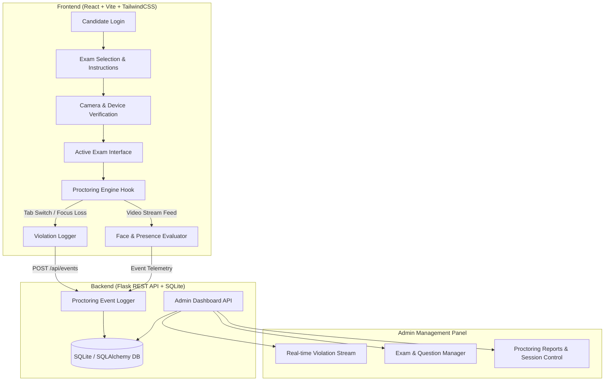
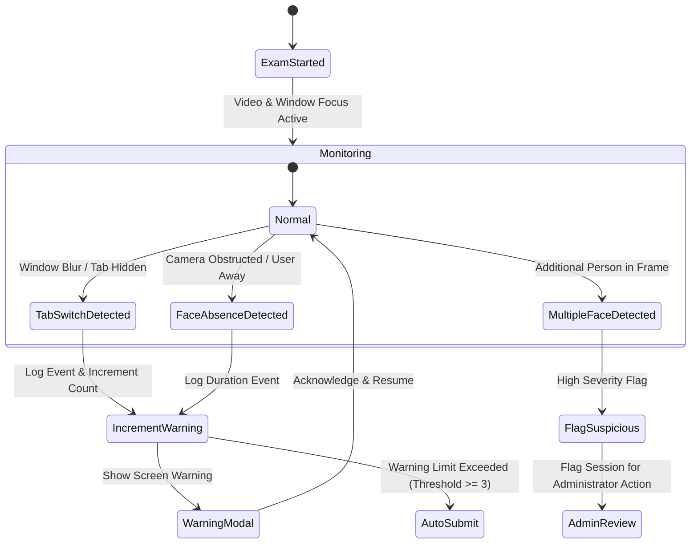

# 🛡️ AI Smart Exam Monitor (ExamGuard)

[](https://github.com/rohith-1806/aismartexammonitor)
[](https://github.com/rohith-1806/aismartexammonitor)
[](https://react.dev/)
[](https://vitejs.dev/)
[](https://www.python.org/)
[](https://flask.palletsprojects.com/)
[](https://tailwindcss.com/)
[](LICENSE)

An intelligent, real-time automated AI proctoring and online examination monitoring platform built with **React**, **Vite**, **TailwindCSS**, **Flask**, and **OpenCV**. Developed by **PATHAN KHADAR KHAN**.

---

## 📖 Overview

**AI Smart Exam Monitor** (also known as **ExamGuard**) is a modern web application designed to ensure integrity and fairness in remote online examinations. The system combines an intuitive candidate examination interface with a robust administrator portal backed by an automated AI proctoring rule engine.

By constantly evaluating candidate behavioral signals—such as browser focus, tab switching frequency, face presence, and multiple person detection—the application logs violations, issues interactive warnings, and auto-submits or suspends suspicious exam sessions.

---

## 🚨 Problem Statement

With the rapid expansion of remote learning and online certification programs, maintaining academic integrity during examinations has become a critical challenge. Traditional online tests suffer from:
1. **Unmonitored Tab Switching**: Candidates navigating to external websites or search engines for answers.
2. **Impersonation & Unattended Exams**: Candidates leaving the camera frame or allowing surrogates to take the test.
3. **Collaborative Cheating**: Multiple individuals present in the room giving unauthorized assistance.
4. **Lack of Real-Time Analytics**: Instructors lacking centralized, real-time proctoring data and audit trails.

**AI Smart Exam Monitor** solves these issues through real-time client and server-side proctoring controls, automated anomaly detection, and actionable administrative reports.

---

## ✨ Key Features

### 🎓 Candidate Examination Portal
- **🔐 Secure Authentication**: Role-based authentication supporting both candidates and administrators.
- **🎥 Real-Time Video Proctoring**: Live camera capture monitoring candidate face presence.
- **🚫 Anti-Cheating Controls**:
  - Full-screen mode enforcement.
  - Tab switch counter with configurable violation thresholds.
  - Window focus loss detection.
  - Long inactivity detection.
- **⏱️ Interactive Exam Suite**:
  - Live remaining time counter with automatic submission upon timeout.
  - Question grid navigation with status tracking (Answered, Unanswered, Marked for Review).
  - Clear feedback on candidate responses.

### 🛠️ Administrator Management Panel
- **📊 Real-Time Proctoring Dashboard**: View live examination status, active candidate count, and violation logs.
- **📝 Exam & Question Management**: Create, edit, and publish custom exams with configurable question banks and options.
- **👥 Candidate Roster**: Manage registered candidates, assign exams, and inspect candidate activity history.
- **⚠️ Automated Incident Logging**: Detailed breakdown of proctoring events per candidate (Tab switches, Face Absence duration, Multiple face alerts).
- **🛑 Candidate Suspension Control**: Ability for administrators to review flag severity and terminate non-compliant sessions.

---

## ⚙️ System Architecture & Workflow

The system follows a modular decoupled architecture: a **React + Vite** single-page application (SPA) communicating via RESTful API services with a **Flask + SQLAlchemy** backend engine.



### 🧠 Proctoring Rule Engine Logic


---

## 🛠️ Technology Stack

### Core Technologies
| Layer | Technology | Description |
| :--- | :--- | :--- |
| **Frontend Framework** | React 18.2 | Component-driven user interface |
| **Build Tool / Bundler** | Vite 8.2 | Ultra-fast HMR module bundler |
| **Styling & Design** | TailwindCSS 3.3 | Utility-first CSS framework |
| **Routing** | React Router DOM 6.14 | Client-side routing & route guards |
| **Icons** | Lucide React | Clean, scalable UI icons |
| **Backend Framework** | Flask 3.0 | Lightweight Python web framework |
| **Database ORM** | SQLAlchemy 3.1 | Python SQL toolkit and Object Relational Mapper |
| **Database** | SQLite 3 | Lightweight relational database engine |
| **Authentication** | PyJWT 2.8 & Werkzeug | JWT token auth & secure password hashing |
| **Computer Vision** | OpenCV (opencv-python 4.10) | Image processing & video frame analysis |
| **CORS** | Flask-Cors 5.0 | Cross-Origin Resource Sharing handler |

---

## 🚀 Installation & Setup

### Prerequisites
Make sure you have the following installed on your machine:
- **Node.js**: v18.0.0 or higher
- **npm**: v9.0.0 or higher
- **Python**: v3.10.0 or higher
- **pip**: Latest version

---

### 1️⃣ Clone the Repository
```bash
git clone https://github.com/rohith-1806/aismartexammonitor.git
cd aismartexammonitor
```

---

### 2️⃣ Backend Setup (Python / Flask)

1. Navigate to the `backend` directory:
   ```bash
   cd backend
   ```

2. Create and activate a Python virtual environment:
   - **Windows**:
     ```bash
     python -m venv venv
     venv\Scripts\activate
     ```
   - **macOS / Linux**:
     ```bash
     python3 -m venv venv
     source venv/bin/activate
     ```

3. Install required Python packages:
   ```bash
   pip install -r requirements.txt
   ```

4. Initialize and seed the SQLite database:
   ```bash
   python seed_data.py
   ```

5. Start the Flask API server:
   ```bash
   python app.py
   ```
   *The Flask API server will start on **`http://127.0.0.1:5000`**.*

---

## 💻 How to Run the Application

To run the complete system locally, run both backend and frontend servers simultaneously:

| Component | Directory | Command | URL |
| :--- | :--- | :--- | :--- |
| **Flask API Backend** | `./backend` | `python app.py` | `http://127.0.0.1:5000` |
| **Vite React Frontend** | `./` | `npm run dev` | `http://localhost:3000` |

---

## 🔑 Test Credentials & Usage

The application comes pre-seeded with sample user accounts for instant testing:

<details>
<summary>🔑 <b>Click to View Pre-Seeded Test Credentials</b></summary>

<br>

#### 👨‍💼 Administrator Account
- **Role**: System Administrator
- **Email**: `admin@gmail.com`
- **Password**: `admin@123`
- **Access**: Full Admin Dashboard, Exam Management, Candidate Roster, & Proctoring Reports.

#### 👨‍🎓 Candidate Account 1
- **Role**: Candidate
- **Email**: `vaishu@instituion.edu`
- **Password**: `vaishu@787`
- **Access**: Candidate Portal, Assigned Examinations, & Live Test Interface.

#### 👩‍🎓 Candidate Account 2
- **Role**: Candidate
- **Email**: `monisha@instituion.edu`
- **Password**: `monisha@0703`
- **Access**: Candidate Portal, Assigned Examinations, & Live Test Interface.

</details>

---

</details>

<details>
<summary>📊 <b>Administrator Workflow Experience</b></summary>

1. **Login**: Admin logs in using administrative credentials.
2. **Management Overview**: Real-time summary cards displaying active exams, total candidate submissions, and violation alerts.
3. **Exam Builder**: Create new exams, input multiple-choice questions, set duration limits, and assign candidates.
4. **Proctoring Audit Log**: Inspect timestamps and details of every violation event (tab switch, face absence, multiple faces) recorded during test sessions.

</details>

---

## 🔮 Future Enhancements

- [ ] **Gaze & Eye-Tracking AI**: Detect off-screen eye movements using deep learning models (e.g., MediaPipe Face Mesh).
- [ ] **Audio Anomaly Detection**: Real-time microphone monitoring to flag background voices and whisper signals.
- [ ] **Automated ID Verification**: Match candidate photo on test day against uploaded institutional identity cards.
- [ ] **AWS S3 / Cloud Media Backup**: Secure cloud storage for recorded proctoring video feeds and snapshot logs.

---

## 👤 Author

<strong>**PATHAN KHADAR KHAN**</strong>
- **Repository**: [aismartexammonitor](https://github.com/rohith-1806/aismartexammonitor)

---

## 📄 License

This project is licensed under the **MIT License** - see the [LICENSE](LICENSE) file for details.
